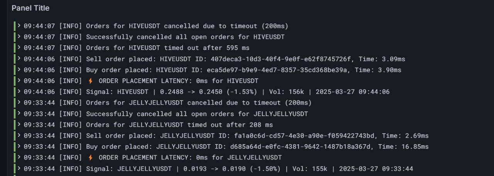

# HIGH-FREQUENCY INFRA SETUP

```
██╗  ██╗███████╗████████╗    ████████╗██████╗  █████╗ ██████╗ ███████╗
██║  ██║██╔════╝╚══██╔══╝    ╚══██╔══╝██╔══██╗██╔══██╗██╔══██╗██╔════╝
███████║█████╗     ██║          ██║   ██████╔╝███████║██║  ██║█████╗  
██╔══██║██╔══╝     ██║          ██║   ██╔══██╗██╔══██║██║  ██║██╔══╝  
██║  ██║██║        ██║          ██║   ██║  ██║██║  ██║██████╔╝███████╗
╚═╝  ╚═╝╚═╝        ╚═╝          ╚═╝   ╚═╝  ╚═╝╚═╝  ╚═╝╚═════╝ ╚══════╝
```

**Low-latency trading infrastructure built for 1-3ms average fill registration**

---

## Overview

This setup provisions infrastructure colocated with Bybit's AWS Singapore deployment (apse1-az3). After running latency tests across availability zones, apse1-b consistently showed the lowest latency and is the recommended deployment target.

The VM is optimized at the system and network level for high-frequency trading workloads. Key optimizations include disabled Nagle's algorithm, hypertuned networking stack, CPU core pinning, and Docker pre-configured for containerized execution.

Monitoring is built-in via Prometheus and Grafana. Optional log aggregation available through Promtail and Loki.

When paired with optimized Rust execution scripts, this infrastructure achieves sub-1ms fill times under optimal conditions.

---

## Prerequisites

You'll need the following installed and configured:

- Public/private SSH key pair in `~/.ssh`
- AWS CLI v2 or higher
- Terraform 1.5.0+

---

## Setup

**1. Configure your environment**

Edit these files to match your setup:
```
terraform.tfvars
variables.tf
```

**2. Initialize Terraform**
```bash
terraform init
```

**3. Review the plan**
```bash
terraform plan
```

**4. Deploy**
```bash
terraform apply -auto-approve
```

---

## Teardown

To destroy all provisioned resources:
```bash
terraform destroy
```

---

## Monitoring

The stack includes Prometheus and Grafana pre-configured for latency monitoring and system metrics. Grafana dashboards provide real-time visibility into fill latency (p50, p95, p99), network performance, and resource utilization.

For centralized logging, integrate Promtail and Loki to correlate metrics with application logs.

---

## Performance Notes

This infrastructure is built specifically for latency-critical trading. Through system tuning, CPU pinning, and network optimizations, it consistently delivers sub-millisecond response times for order fill registration when used with optimized execution code.

Target metrics under optimal conditions:
- Average fill registration: 1-3ms
- Peak performance: sub-1ms
- Deployment region: AWS Singapore (apse1-b)