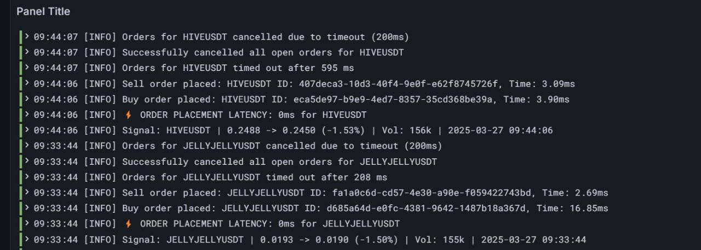

# ⚡ HIGH-FREQUENCY INFRA SETUP

```
██╗  ██╗███████╗████████╗    ████████╗██████╗  █████╗ ██████╗ ███████╗
██║  ██║██╔════╝╚══██╔══╝    ╚══██╔══╝██╔══██╗██╔══██╗██╔══██╗██╔════╝
███████║█████╗     ██║          ██║   ██████╔╝███████║██║  ██║█████╗  
██╔══██║██╔══╝     ██║          ██║   ██╔══██╗██╔══██║██║  ██║██╔══╝  
██║  ██║██║        ██║          ██║   ██║  ██║██║  ██║██████╔╝███████╗
╚═╝  ╚═╝╚═╝        ╚═╝          ╚═╝   ╚═╝  ╚═╝╚═╝  ╚═╝╚═════╝ ╚══════╝
```

> **Ultra-low latency trading infrastructure engineered for sub-millisecond execution**  
> 🎯 **1–3ms average fill registration** | 🚀 **Sub-1ms optimal performance**

---

## 🌐 OVERVIEW

This infrastructure is purpose-built to colocate with **Bybit's AWS Singapore** deployment (`apse1-az3`). Extensive latency testing confirms `apse1-b` as the optimal availability zone for deployment.

### ⚙️ INFRASTRUCTURE HIGHLIGHTS

```
┌─────────────────────────────────────────────┐
│  🔧 SYSTEM OPTIMIZATIONS                    │
├─────────────────────────────────────────────┤
│  ✓ Nagle's algorithm disabled               │
│  ✓ Hypertuned networking stack              │
│  ✓ CPU core pinning enabled                 │
│  ✓ Predictable latency under load           │
└─────────────────────────────────────────────┘

┌─────────────────────────────────────────────┐
│  📦 PRE-CONFIGURED STACK                    │
├─────────────────────────────────────────────┤
│  ✓ Docker runtime                           │
│  ✓ Prometheus + Grafana monitoring          │
│  ✓ Promtail + Loki (optional)               │
│  ✓ Production-ready metrics & dashboards    │
└─────────────────────────────────────────────┘
```

**Seamless integration** with Rust execution scripts for **sub-millisecond order fills** under optimal network conditions.

---

## 📋 PREREQUISITES

Before provisioning, ensure you have:

- [ ] **SSH key pair** in `~/.ssh/`
- [ ] **AWS CLI v2+** installed and configured
- [ ] **Terraform 1.5.0+** installed

---

## 🚀 SETUP INSTRUCTIONS

### **1️⃣ Configure Your Environment**

Adjust these files to match your deployment requirements:

```bash
📝 terraform.tfvars
📝 variables.tf
```

### **2️⃣ Initialize Terraform**

```bash
terraform init
```

### **3️⃣ Review the Execution Plan**

```bash
terraform plan
```

### **4️⃣ Deploy Infrastructure**

```bash
terraform apply -auto-approve
```

🎉 **Your high-frequency trading infrastructure is now live!**

---

## 🗑️ TEARDOWN

To destroy all provisioned resources:

```bash
terraform destroy
```

---

## 📊 MONITORING & OBSERVABILITY

### **Real-Time Metrics**

This setup includes a **production-grade monitoring stack**:

| Tool | Purpose |
|------|---------|
| 📈 **Prometheus** | Metrics collection & time-series storage |
| 📊 **Grafana** | Real-time visualization dashboards |
| 📝 **Promtail + Loki** | Centralized log aggregation (optional) |

### **Key Metrics Tracked**

- Order fill latency (p50, p95, p99)
- Network round-trip times
- CPU core utilization
- System resource health

Access Grafana dashboards to visualize **latency trends** and **infrastructure health** in real-time.

---

## ⚠️ IMPORTANT NOTES

> **This infrastructure is engineered for latency-critical high-frequency trading environments.**

Through aggressive system tuning, strategic CPU pinning, and network stack optimization, this setup consistently achieves:

- ✅ **Sub-millisecond response times** for order fill registration
- ✅ **Predictable performance** under market volatility
- ✅ **Production stability** with comprehensive observability

Pair this infrastructure with optimized Rust execution scripts to unlock **maximum performance**.

---

<div align="center">

**Built for speed. Optimized for precision. Engineered for HFT.**

```
┌─────────────────────────────────────┐
│  🎯 TARGET: SUB-1MS FILLS           │
│  📍 REGION: AWS Singapore (apse1-b) │
│  🔥 STATUS: PRODUCTION READY        │
└─────────────────────────────────────┘
```

</div>